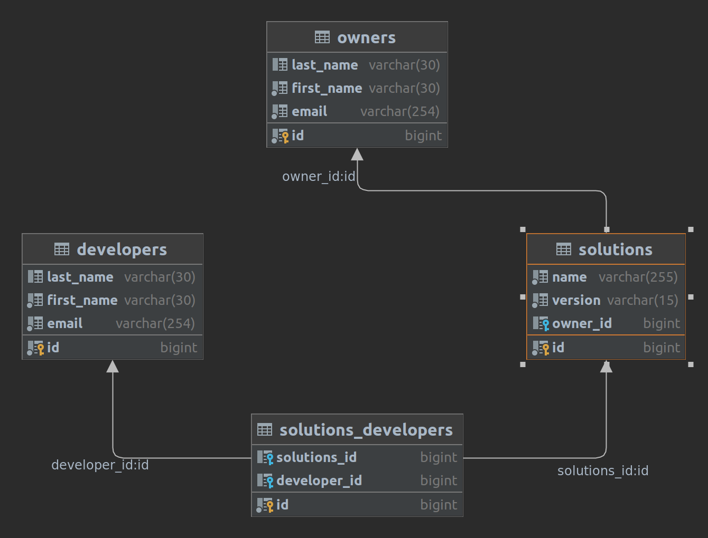

# REST-JDBC-Servlet
Приложение старовер. Написано для дополнительного понимания как строились приложения до Spring и Hibernate.
Так же потренировался в использовании Testcontainers.
Совсем без технологий, конечно, не обошлось. Используются Mapstruct, Lombok и прочие Slf4j.
___

_by Ruslan Rodionov_

___
Структура приложения простая:
Имеются:
- Проекты (Solutions);
- Владельцы (Owners);
- Разработчики (Developers).

У Проекта может быть один Владелец и несколько Разработчиков.
У Владельца может быть несколько Проектов.
У Разработчика может быть несколько Проектов.

Владелец -(один-ко-многим)- Проект -(многие-ко-многим)- Разработчик.
Собственно см. схему:

### _Техстэк:_
- #### Java 17
- #### HTTPServlet
- #### JDBC
- #### Postgres
- #### Mapstruct
- #### Lombok 
- #### Slf4j
- #### JUnit5
- #### Testcontainers
